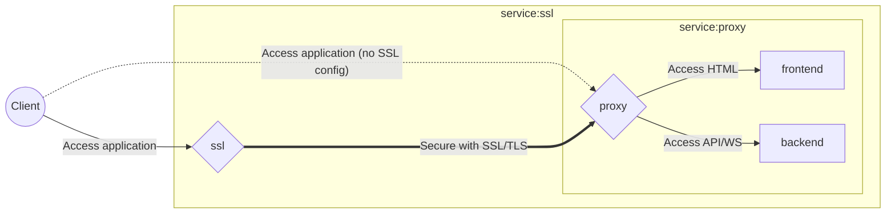

# Roulette

> Jeu de roulette

## Run with docker-compose

This application can be launched with the following command:

```bash
docker compose up
```

By default, the application is available at `http://localhost:8080`.

> This is a version without any SSL (for tests, dev purposes or even if another security layer is used (e.g. inside a kubernetes)).

### With HTTPS and WSS

```bash
docker compose -f ./docker-compose.yml -f ./docker-compose.ssl.yml up
```

By default, the application is available at `http://localhost:8080` and `https://localhost:8443`.

> The HTTP always redirect to HTTPS.  
> The default certificates are self-signed.


### Schema

Here's a little schema to understand the "infrastructure"



> The arrow between `client` and `proxy` only exists with the first [docker-compose](#run-with-docker-compose) configuration.
