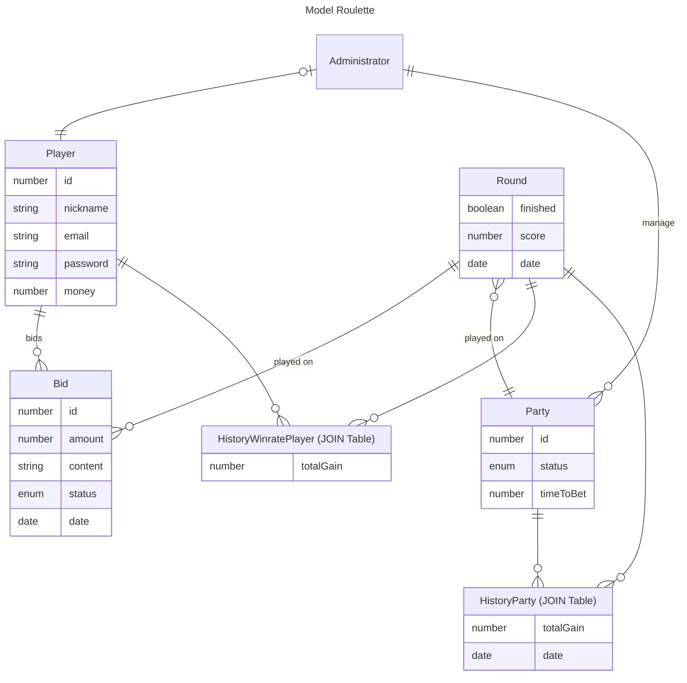

# Roulette

Jeu de roulette ...

## Spécifications

### Roles

- _Player_ : Personne qui se connecte et joue
- _Administrator_ : "Manager"
- _Party_ : Entité auto-managée

### Scénarii utilisateurs

- En tant que _Player_,
  - je veux pouvoir me connecter et visualiser ma somme
  - je veux pouvoir miser une somme pour une _Party_
  - je ne peux pas miser une somme que je ne possède pas _réellement_ (mise trop haute ou mises dans plusieurs _Party_)
  - je ne veux pas perdre ma mise sur une manche si je me déconnecte au moment du résultat.
- En tant que _Administrator_,
  - je veux pouvoir arrêter ou démarrer des _Party_
  - je veux pouvoir contrôller une _Party_ manuellement (start/stop manche)
  - je veux également pouvoir être un _Player_
- En tant que _Party_,
  - je veux pouvoir démarrer et arrêter une manche automatiquement (timers)
  - je n'autorise pas plusieurs mises d'un même utilisateur par manche

### Modélisation entitée

