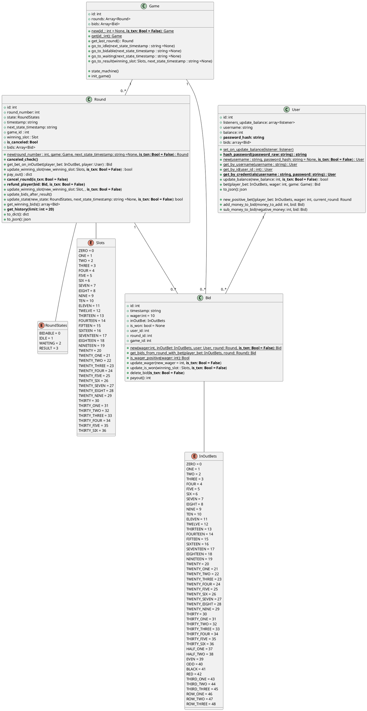

```plantuml
@startuml
enum RoundStates {
	BIDABLE = 0
	IDLE = 1
	WAITING = 2
	RESULT = 3
}

enum InOutBets {
	ZERO = 0
	ONE = 1
	TWO = 2
	THREE = 3
	FOUR = 4
	FIVE = 5
	SIX = 6
	SEVEN = 7
	EIGHT = 8
	NINE = 9
	TEN = 10
	ELEVEN = 11
	TWELVE = 12
	THIRTEEN = 13
	FOURTEEN = 14
	FIFTEEN = 15
	SIXTEEN = 16
	SEVENTEEN = 17
	EIGHTEEN = 18
	NINETEEN = 19
	TWENTY = 20
	TWENTY_ONE = 21
	TWENTY_TWO = 22
	TWENTY_THREE = 23
	TWENTY_FOUR = 24
	TWENTY_FIVE = 25
	TWENTY_SIX = 26
	TWENTY_SEVEN = 27
	TWENTY_EIGHT = 28
	TWENTY_NINE = 29
	THIRTY = 30
	THIRTY_ONE = 31
	THIRTY_TWO = 32
	THIRTY_THREE = 33
	THIRTY_FOUR = 34
	THIRTY_FIVE = 35
	THIRTY_SIX = 36
	HALF_ONE = 37  
	HALF_TWO = 38  
	EVEN = 39 
	ODD = 40  
	BLACK = 41  
	RED = 42  
	THIRD_ONE = 43 
	THIRD_TWO = 44 
	THIRD_THREE = 45 
	ROW_ONE = 46  
	ROW_TWO = 47 
	ROW_THREE = 48  
}


enum Slots {
	ZERO = 0
	ONE = 1
	TWO = 2
	THREE = 3
	FOUR = 4
	FIVE = 5
	SIX = 6
	SEVEN = 7
	EIGHT = 8
	NINE = 9
	TEN = 10
	ELEVEN = 11
	TWELVE = 12
	THIRTEEN = 13
	FOURTEEN = 14
	FIFTEEN = 15
	SIXTEEN = 16
	SEVENTEEN = 17
	EIGHTEEN = 18
	NINETEEN = 19
	TWENTY = 20
	TWENTY_ONE = 21
	TWENTY_TWO = 22
	TWENTY_THREE = 23
	TWENTY_FOUR = 24
	TWENTY_FIVE = 25
	TWENTY_SIX = 26
	TWENTY_SEVEN = 27
	TWENTY_EIGHT = 28
	TWENTY_NINE = 29
	THIRTY = 30
	THIRTY_ONE = 31
	THIRTY_TWO = 32
	THIRTY_THREE = 33
	THIRTY_FOUR = 34
	THIRTY_FIVE = 35
	THIRTY_SIX = 36
}

class Game {
    + id: int
    + rounds: Array<Round>
    + bids: Array<Bid>

    + {static}new(id_: int = None, **is_txn: Bool = False**): Game
    + {static}get(id_:int): Game
    + get_last_round() : Round
    + go_to_idle(next_state_timestamp : string =None)
    + go_to_bidable(next_state_timestamp : string =None)
    + go_to_waiting(next_state_timestamp : string =None)
    + go_to_result(winning_slot: Slots, next_state_timestamp : string =None)

    + state_machine()
    + init_game()
}

class Round {
    + id: int
    + round_number: int
    + state: RoundStates
    + timestamp: string
    + next_state_timestamp: string
    + game_id : int
    + winning_slot : Slot
    + **is_canceled: Bool**
    + bids: Array<Bid>

    + {static}new(round_number : int, game: Game, next_state_timestamp: string =None, **is_txn: Bool = False**) : Round
    + **canceled_check()**
    + get_bet_on_inOutbet(player_bet: InOutBet, player: User) : Bid
    + update_winning_slot(new_winning_slot: Slots, **is_txn: Bool = False**) : bool
    + pay_out() : dict
    + **cancel_round(is_txn: Bool = False)**
    + **refund_player(bid: Bid, is_txn: Bool = False)**
    + update_winning_slot(new_winning_slot: Slot, , **is_txn: Bool = False**)
    + update_bids_after_result()
    + update_state(new_state: RoundStates, next_state_timestamp: string =None, **is_txn: Bool = False**): bool
    + get_winning_bids(): array<Bid>
    + **get_history(limit: int = 20)**
    + to_dict(): dict
    + to_json(): json
}

class User {
    + id: int
    + listeners_update_balance: array<listener>
    + username: string
    + balance: int
    + **password_hash: string**
    + bids: array<Bid>


    + {static}set_on_update_balance(listener: listener)
    + {static}**hash_password(password_raw: string) : string**
    + {static}new(username : string, password_hash: string = None, **is_txn: Bool = False**) : User
    + {static}get_by_username(username : string) : User
    + {static}get_by_id(user_id : int) : User
    + {static}**get_by_credentials(username : string, password: string) : User**
    + update_balance(new_balance: int, **is_txn: Bool = False**) : bool
    + bet(player_bet: InOutBets, wager: int, game: Game) : Bid
    + to_json(): json
    
    + new_positive_bet()player_bet: InOutbets, wager: int, current_round: Round
    + add_money_to_bid(money_to_add: int, bid: Bid)
    + sub_money_to_bid(negative_money: int, bid: Bid)
}

class Bid {
    + id: int
    + timestamp: string
    + wager:int = 10
    + inOutBet: InOutBets
    + is_won: bool = None
    + user_id: int
    + round_id: int
    + game_id: int

    +{static}new(wager:int, inOutBet: InOutBets, user: User, round: Round, **is_txn: Bool = False**): Bid
    +{static}get_bids_from_round_with_bet(player_bet: InOutBets, round: Round): Bid
    +{static}is_wager_positive(wager: int): Bool
    +update_wager(new_wager = int, **is_txn: Bool = False**)
    +update_is_won(winning_slot : Slots, **is_txn: Bool = False**)
    +delete_bid(**is_txn: Bool = False**)
    +payout(): int
}
Game "1" -- "0..*" Round
Game "1" -- "0..*" Bid
Round "1" -- "0..*" Bid
User "1" -- "0..*" Bid

Round -- RoundStates
Round -- Slots
Bid -- InOutBets
@enduml
```

