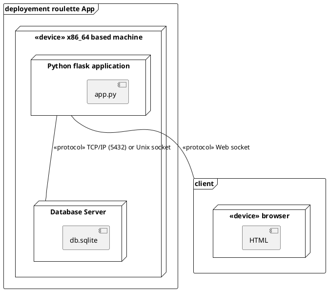

# Diagram deployement et composant

J'utilise plantUML, voila le WIP




Component Diagram

```
@startuml
node "<<provided interface>> Roulette UI" as rouletteui {

}


node "<<provided interface>> Add/remove funds UI" as moneyui{

}


node "<<provided interface>> Login UI" as loginui{

}

component "<<subsystem>> onlineCasino" as front {


  [:gameEngine] as gameengine
  [:LoginEngine] as loginengine
  [:cashExchangeEngine] as cashexchange
}

component "<<substytem>> UserInfoVault" as bank {
  component [:AccountData] as data
}


gameengine --> data : update funds  (required interface, dependency)
cashexchange --> data : update funds  (required interface, dependency)

loginengine --> data : verify user data (required interface, dependency)
loginengine --> data : add new user (required interface, dependency)


loginui -- loginengine : port
moneyui -- cashexchange : port
rouletteui -- gameengine : port
@enduml
```

